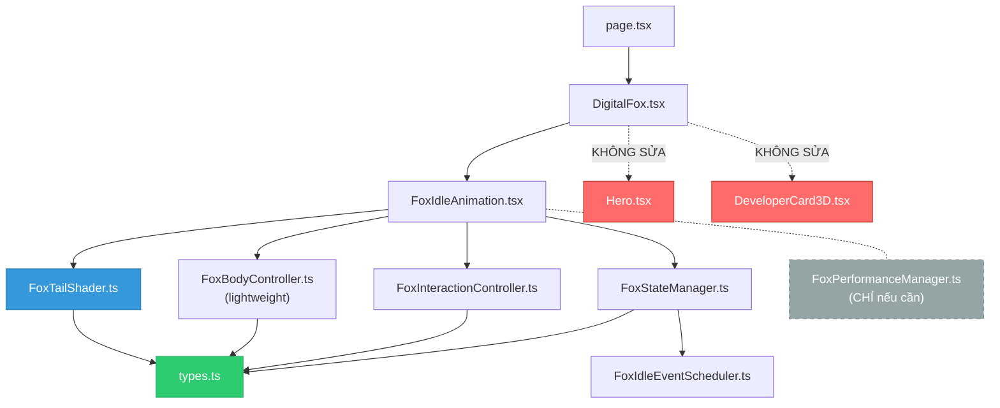

# PET FOX — KẾ HOẠCH THỰC THI CHI TIẾT (v2)

> **Project:** `porfolio_khoa` / Portfolio-AnhKhoa
> **Production:** `https://www.bily.id.vn/`
> **Tài liệu gốc:** `docs/PET_FOX_DEVELOPMENT_MASTER_PLAN.md`
> **Ngày lập:** 25/09/2026
> **Revision:** v2 — Đã tích hợp toàn bộ Owner Feedback
> **Trạng thái hiện tại:** Phase 0 AUDIT hoàn tất — sẵn sàng Phase 1
> **Mục đích:** Hướng dẫn AI Gemini 3.8 Flash thực thi từng bước chính xác, giảm thiểu lỗi

---

# CHANGELOG v1 → v2

| # | Thay đổi | Lý do |
|---|---------|-------|
| 🔴 1 | Thêm SHA-256 hash verification cho `fox.glb` (Phase 1 + Phase 10) | INV-01 được kiểm chứng bằng data, không chỉ file size |
| 🔴 2 | Phase 3 head/ear thêm **feasibility gate**: analyze → visualize → FEASIBLE? → YES/NO | Single mesh model có thể không isolate được head/ear vertices sạch |
| 🟠 3 | Giảm over-engineering State/Scheduler — chỉ `cooldown/duration/weight`, thêm `priority/interruptible` khi thực sự cần | Portfolio pet không cần game AI system |
| 🔴 4 | Phase 7 lấy 83MB asset metrics làm trọng tâm; Lighthouse là reference, không phải hard gate | Lighthouse bị ảnh hưởng bởi nhiều thứ ngoài Fox |
| 🟠 5 | Build theo **logical checkpoint groups**, không build sau từng file | Giảm context churn, tăng tốc AI execution |
| 🟡 6 | Phase 2: giá trị là candidates, AI chọn nhỏ nhất đạt visual target | 929K vertices + 1.49M tris → framing thay đổi mạnh |
| 🟡 7 | Phase 4: cursor tracking proximity-based (distance to fox → influence) | Tự nhiên hơn absolute viewport |
| 🟡 8 | Phase 6: flourish cooldown tăng (40-70s lần đầu, 60-120s lần sau) | Rare event, không phải recurring |
| 🟡 9 | Dependency graph cập nhật theo kiến trúc owner đề xuất | Lean architecture |
| 🟡 10 | Thêm Risk Matrix cho mỗi Phase | AI biết phase nào cần kiểm soát chặt |
| 🟡 11 | FoxPerformanceManager chỉ tạo khi Phase 7 chứng minh cần | Không pre-create unnecessary modules |
| 🟡 12 | Phase 8: xem xét lại hidden < 380px threshold | Quyết định dựa trên performance, không chỉ CSS |

---

# MỤC LỤC

1. [Tóm tắt trạng thái hiện tại (Baseline)](#1-tóm-tắt-trạng-thái-hiện-tại-baseline)
2. [Ma trận rủi ro](#2-ma-trận-rủi-ro)
3. [Quy tắc bất biến (Invariant Rules)](#3-quy-tắc-bất-biến-invariant-rules)
4. [Tiêu chuẩn kỹ thuật bắt buộc](#4-tiêu-chuẩn-kỹ-thuật-bắt-buộc)
5. [Lỗi phổ biến & phòng tránh](#5-lỗi-phổ-biến--phòng-tránh)
6. [Phase 1 — Repository & Asset Safety](#6-phase-1--repository--asset-safety)
7. [Phase 2 — Fox Visual Foundation](#7-phase-2--fox-visual-foundation)
8. [Phase 3 — Core Creature Motion](#8-phase-3--core-creature-motion)
9. [Phase 4 — Interaction System](#9-phase-4--interaction-system)
10. [Phase 5 — Random Idle System](#10-phase-5--random-idle-system)
11. [Phase 6 — Special Flourish](#11-phase-6--special-flourish)
12. [Phase 7 — Performance Optimization](#12-phase-7--performance-optimization)
13. [Phase 8 — Responsive & Accessibility](#13-phase-8--responsive--accessibility)
14. [Phase 9 — Final QA](#14-phase-9--final-qa)
15. [Phase 10 — Production Deploy](#15-phase-10--production-deploy)
16. [Quy trình báo cáo sau mỗi Phase](#16-quy-trình-báo-cáo-sau-mỗi-phase)
17. [Phụ lục A — File Map](#phụ-lục-a--file-map)
18. [Phụ lục B — Dependency Graph](#phụ-lục-b--dependency-graph)
19. [Phụ lục C — Kiến trúc đề xuất](#phụ-lục-c--kiến-trúc-đề-xuất)

---

# 1. TÓM TẮT TRẠNG THÁI HIỆN TẠI (BASELINE)

## 1.1. Build & TypeScript

| Mục | Trạng thái |
|-----|-----------|
| `npm run build` | ✅ PASS (exit code 0) |
| TypeScript strict | ✅ PASS (no errors) |
| Routes: `/`, `/cv`, `/robots.txt`, `/sitemap.xml` | ✅ 200 OK |
| Debug routes (`/fox-test`) | ✅ Không tồn tại (404) |

## 1.2. File Architecture hiện tại

| File | Vai trò | Lines |
|------|---------|-------|
| [`page.tsx`](file:///d:/porfolio1/porfolio_khoa/src/app/page.tsx) | Root page, render `<DigitalFox />` cuối trang | 46 |
| [`DigitalFox.tsx`](file:///d:/porfolio1/porfolio_khoa/src/components/DigitalFox.tsx) | Container component, Canvas, lighting, companion mode | 248 |
| [`FoxIdleAnimation.tsx`](file:///d:/porfolio1/porfolio_khoa/src/components/FoxIdleAnimation.tsx) | 7-layer procedural animation controller | 253 |
| [`FoxTailShader.ts`](file:///d:/porfolio1/porfolio_khoa/src/components/fox/FoxTailShader.ts) | GPU vertex shader, 3-tail blend skinning | 327 |
| [`Hero.tsx`](file:///d:/porfolio1/porfolio_khoa/src/components/Hero.tsx) | Hero section (KHÔNG ĐƯỢC SỬA) | 193 |

## 1.3. Fox Technical Profile

| Thuộc tính | Giá trị |
|-----------|---------|
| Model | `public/models/fox.glb` |
| File size | ~83 MB |
| Vertices | ~929,022 |
| Triangles | ~1.49M |
| Geometry islands | ~9,529 |
| Bone/skeleton | ❌ Không có |
| Morph targets | ❌ Không có |
| Animation clips | ❌ Không có |
| Node structure | 1 root node (`node_0`) + 90° X rotation |
| Tail vertices | ~226K (Left: ~97K, Center: ~76K, Right: ~53K) |
| Body vertices | ~703K |

## 1.4. Animation Layers hiện tại

| Layer | Mô tả | Biên độ thực tế | Đánh giá |
|-------|--------|-----------------|----------|
| L1: Body Breathing | Scale Y ±1.8%, XZ ±1.1% | Rất nhỏ | ⚠️ Khó nhận biết |
| L2: Floating | Y ±0.055 | ~3px trên màn hình | ⚠️ Nhỏ |
| L3: Posture Sway | Yaw/Roll/Pitch < 0.5° | Gần như không thấy | ⚠️ Quá nhỏ |
| L4: GPU Tail | Max ±4.7° lateral, ±2.7° vertical | Rất khó thấy ở scale hiện tại | ⚠️ Cần tăng |
| L5: Cursor Tracking | ±9.2° yaw, ±5.1° pitch | Hoạt động, damping 0.04 | ✅ OK |
| L6: Hover Response | +2.5% lift, +3.5% tilt | Hoạt động | ✅ OK |
| L7: Reduced Motion | Tắt toàn bộ animation | Hoạt động | ✅ OK |

## 1.5. Vấn đề cần giải quyết (từ Audit)

| # | Vấn đề | Mức độ | Phase |
|---|--------|--------|-------|
| 1 | Fox quá nhỏ trên màn hình (companion ~300×340px max) | P1 | 2 |
| 2 | Camera front-on (Y rotation -0.42) che tail | P1 | 2 |
| 3 | Tail amplitude quá nhỏ, khó nhận biết | P1 | 2, 3 |
| 4 | Chưa có head movement riêng (fox không có bone) | P1 | 3 |
| 5 | Chưa có ear twitch | P1 | 3, 5 |
| 6 | Chưa có body weight shift | P1 | 3 |
| 7 | Chưa có state machine | P2 | 5 |
| 8 | Chưa có random idle events | P2 | 5 |
| 9 | Chưa có flourish/anticipation/settle | P2 | 6 |
| 10 | Chưa có blink system | P2 | 5 |
| 11 | Material plastic feel | P1 | 2 |
| 12 | 83MB asset chưa benchmark mobile | P0 | 1 |
| 13 | Chưa có performance tiers | P3 | 7 |

---

# 2. MA TRẬN RỦI RO

| Phase | Risk | Lý do | Biện pháp kiểm soát |
|-------|------|-------|---------------------|
| P1 | 🟢 Thấp | Safety/check thuần túy | Chạy lệnh, ghi nhận kết quả |
| P2 | 🟡 Trung bình | Camera/material/shader tuning | Thay đổi từng giá trị, visual test mỗi bước |
| **P3** | **🔴 Cao** | **Single mesh + head/ear vertex classification** | **Feasibility gate bắt buộc. Không isolate được → fallback** |
| P4 | 🟡 Trung bình | Interaction / cursor logic | Proximity-based, test trên desktop |
| P5 | 🟠 Khá cao | State + scheduler + multiple events | Bắt đầu đơn giản, thêm complexity khi cần |
| P6 | 🟠 Khá cao | Multi-state animation sequence | Rare event, cooldown dài, interrupt logic |
| **P7** | **🔴 Cao** | **83MB + WebGL + adaptive performance** | **Asset metrics là trọng tâm, hardware detection là tham khảo** |
| P8 | 🟡 Trung bình | Responsive / accessibility | Test matrix 5 viewports |
| P9 | 🟢 Thấp | QA checklist | Systematic testing |
| P10 | 🟢 Thấp | Deployment | Pre-deploy checklist, post-deploy verify |

> [!WARNING]
> **P3 và P7 là hai Phase cần kiểm soát chặt nhất.** AI phải dành thêm effort cho feasibility analysis và performance measurement tại hai Phase này.

---

# 3. QUY TẮC BẤT BIẾN (INVARIANT RULES)

> [!CAUTION]
> AI **BẮT BUỘC** phải kiểm tra từng rule này TRƯỚC mỗi code change. Vi phạm bất kỳ rule nào → rollback ngay lập tức.

### 3.0. Thứ tự ưu tiên (Priority Hierarchy)

Nếu có xung đột giữa các mục tiêu trong quá trình thực thi, thứ tự ưu tiên tuyệt đối:
1. **Asset integrity** (fox.glb immutable, SHA-256 identical xuyên suốt)
2. **Existing portfolio stability** (Hero, DeveloperCard3D, build clean, no regressions)
3. **Performance** (không jank, 60fps desktop, asset metrics kiểm soát)
4. **Layout / CTA usability** (Download CV, Contact Me rõ ràng, không bị che)
5. **Natural animation** (breathing, tail secondary motion, weight shift mượt)
6. **Extra animation features** (head/ear twitch, flourish)

*Quy tắc: BETTER ANIMATION > MORE ANIMATION, nhưng PERFORMANCE > VISUAL EFFECT.*

### 3.1. Tuyệt đối KHÔNG được sửa

| Rule ID | Nội dung |
|---------|----------|
| INV-01 | `public/models/fox.glb` — KHÔNG optimize, compress, decimate, replace. **SHA-256 hash phải giống nhau từ Phase 1 đến Phase 10** |
| INV-02 | [`Hero.tsx`](file:///d:/porfolio1/porfolio_khoa/src/components/Hero.tsx) — KHÔNG sửa |
| INV-03 | [`DeveloperCard3D.tsx`](file:///d:/porfolio1/porfolio_khoa/src/components/DeveloperCard3D.tsx) — KHÔNG sửa |
| INV-04 | [`Card3DLanyard.tsx`](file:///d:/porfolio1/porfolio_khoa/src/components/Card3DLanyard.tsx) — KHÔNG sửa |
| INV-05 | SEO metadata, `robots.txt`, `sitemap.xml` — KHÔNG sửa |
| INV-06 | Production routes behavior — KHÔNG thay đổi |

### 3.2. Tuyệt đối KHÔNG được phá vỡ

| Rule ID | Nội dung | Cách kiểm tra |
|---------|----------|---------------|
| INV-07 | CTA buttons phải click được | Browser test: click "Download CV" và "Contact Me" |
| INV-08 | `pointer-events` isolation | Fox container `pointer-events: auto`, nhưng không block bất kỳ UI nào phía dưới |
| INV-09 | `prefers-reduced-motion` | Bật reduced-motion → Fox phải giảm/tắt animation |
| INV-10 | TypeScript strict mode | `npm run build` phải exit code 0 |
| INV-11 | Responsive layout | Mobile/tablet/desktop phải render đúng |
| INV-12 | Existing shader pipeline | GPU tail deformation phải tiếp tục hoạt động |

### 3.3. Nguyên tắc code

| Rule ID | Nội dung |
|---------|----------|
| INV-13 | KHÔNG tạo `new Vector3()`, `new Quaternion()`, `new Material()` trong animation loop (`useFrame`) |
| INV-14 | KHÔNG tạo nhiều `requestAnimationFrame` độc lập — dùng `useFrame` duy nhất |
| INV-15 | KHÔNG dùng `any` type trừ khi bắt buộc (và phải giải thích) |
| INV-16 | KHÔNG import thêm physics engine (ammo.js, cannon.js, rapier) nếu procedural đáp ứng được |
| INV-17 | Mỗi phase phải commit riêng, message format: `feat(fox): Phase X — [description]` |

---

# 4. TIÊU CHUẨN KỸ THUẬT BẮT BUỘC

## 4.1. Cấu trúc thư mục

> [!NOTE]
> Chỉ tạo file mới khi complexity thực sự cần. Không tạo module chỉ vì architecture đẹp.

```text
src/components/
├── DigitalFox.tsx              ← Container (sửa tại Phase 2)
├── FoxIdleAnimation.tsx        ← Animation controller chính (sửa tại Phase 3, 4, 5, 6)
└── fox/
    ├── FoxTailShader.ts        ← GPU tail shader (sửa tại Phase 2, 3)
    ├── FoxBodyController.ts    ← NEW: Body animation config + logic (Phase 3) — GIỮ NHẸ
    ├── FoxInteractionController.ts ← NEW: Cursor proximity logic (Phase 4)
    ├── FoxStateManager.ts      ← NEW: Lightweight state machine (Phase 5)
    ├── FoxIdleEventScheduler.ts ← NEW: Simple random event scheduler (Phase 5)
    ├── FoxPerformanceManager.ts ← CHỈ TẠO nếu Phase 7 chứng minh cần
    └── types.ts                ← NEW: Shared types/interfaces (Phase 3)
```

### 4.1.1. Nguyên tắc tách module

```text
✅ Tách khi: logic > 100 lines trong FoxIdleAnimation.tsx VÀ có reuse potential
✅ Tách khi: cần test riêng
❌ KHÔNG tách chỉ vì "mỗi concern một file"
❌ KHÔNG tạo class/framework cho config đơn giản
❌ KHÔNG pre-create file cho phase chưa bắt đầu
```

### 4.1.2. FoxBodyController.ts — GIỮ NHẸ

```typescript
// ✅ ĐÚNG — Lightweight config + pure functions
export const FOX_BREATHING = { period: 3.8, scaleY: 0.025 } as const;

export function computeBreathing(t: number, config = FOX_BREATHING) {
  // ...
  return { scaleY, scaleXZ, liftY };
}

// ❌ SAI — Over-engineered class
class FoxBodyController {
  private state: BodyState;
  private config: BodyConfig;
  constructor(config: BodyConfig) { ... }
  update(dt: number) { ... }
  getTransform() { ... }
}
```

## 4.2. Quy tắc đặt tên

| Loại | Convention | Ví dụ |
|------|-----------|-------|
| File component | PascalCase | `FoxBodyController.ts` |
| Interface | Descriptive noun | `FoxState`, `FoxAnimationConfig` |
| Constant | UPPER_SNAKE_CASE | `FOX_BREATHING_PERIOD` |
| Hook | `use` prefix | `useFoxPerformanceTier` |
| Uniform | `u` prefix | `uFoxTime`, `uTailIntensity` |
| Ref | suffix `Ref` | `groupRef`, `baseScaleRef` |

## 4.3. Animation Parameter Format

Mọi animation parameter phải được khai báo dạng const object, KHÔNG hardcode inline:

```typescript
// ✅ ĐÚNG
export const FOX_BREATHING_CONFIG = {
  period: 3.8,        // seconds
  scaleY: 0.025,      // amplitude — candidate, tune by visual
  scaleXZ: 0.015,
  liftY: 0.008,
} as const;

// ❌ SAI — hardcode inline
const breathScaleY = 1 + Math.sin(t * 1.654) * 0.018;
```

## 4.4. Three.js Object Reuse Pattern

```typescript
// ✅ ĐÚNG — Tạo 1 lần ngoài useFrame
const _tempVec3 = new THREE.Vector3();
const _tempEuler = new THREE.Euler();

useFrame(() => {
  _tempVec3.set(x, y, z);
});

// ❌ SAI — Tạo mỗi frame
useFrame(() => {
  const pos = new THREE.Vector3(x, y, z); // GC pressure!
});
```

## 4.5. Build Checkpoint Strategy

> [!IMPORTANT]
> **KHÔNG build sau từng file nhỏ.** Build theo logical checkpoint groups.

```text
Structural checkpoint (types + module skeleton):
  P3-T01 types.ts
  P3-T02 FoxBodyController.ts (skeleton)
  ↓
  npm run build ← checkpoint

Visual checkpoint (animation tuning):
  P3-T03 breathing amplitude
  P3-T04 weight shift
  P3-T05 sway tuning
  ↓
  npm run build + visual test ← checkpoint

Shader checkpoint (GPU changes):
  P3-T06 head analysis
  P3-T07 head shader (if feasible)
  ↓
  npm run build + WebGL test ← checkpoint
```

## 4.6. Output Format cho mỗi file mới

```typescript
/**
 * @file FoxBodyController.ts
 * @description Lightweight body animation config + pure functions
 * @phase Phase 3 — Core Creature Motion
 * @depends types.ts
 * @invariants INV-13, INV-14
 */
```

---

# 5. LỖI PHỔ BIẾN & PHÒNG TRÁNH

## 5.1. Bảng lỗi — Nguyên nhân — Phòng tránh

| # | Lỗi phổ biến | Nguyên nhân gốc | Cách phòng tránh | Cách khắc phục |
|---|-------------|-----------------|-------------------|----------------|
| E01 | Fox biến mất sau khi sửa code | `<Center>` reset bounds; scale/position sai | Visual test sau mỗi logical checkpoint | Revert; kiểm tra `groupRef` capture |
| E02 | Tail shader không hoạt động | `onBeforeCompile` bị ghi đè; uniform mất reference | Giữ nguyên `hookMaterialTailShader` pattern | Check `material.userData.foxTailShaderApplied` |
| E03 | TypeScript error sau file mới | Import path sai; thiếu export | Build tại structural checkpoint | Đọc error → fix type trước khi tiếp |
| E04 | Animation giật (jank) | Allocate object trong `useFrame`; GC pause | Dùng reusable objects (INV-13) | Chrome DevTools Performance tab |
| E05 | Fox che CTA buttons | Scale quá lớn; z-index xung đột | Test responsive: 1920, 1366, 768, 375 | Giảm scale; kiểm tra `pointer-events` |
| E06 | `useGLTF` crash SSR | Next.js SSR không có WebGL | Giữ `typeof window` guard + `isMounted` | `dynamic(() => import(...), { ssr: false })` |
| E07 | Shader GLSL compile error | Syntax GLSL sai | Console → WebGL errors | Đọc shader error; fix GLSL |
| E08 | Memory leak | Event listeners không cleanup | Mọi `addEventListener` phải có cleanup | Profile Memory tab |
| E09 | `baseScale.current` null | `groupRef` chưa mount khi `useFrame` lần đầu | Giữ null-check + early return | Thêm guard |
| E10 | Reduced-motion không hoạt động | Quên check `reducedMotion` flag | Mọi animation mới PHẢI check flag | Thêm condition |
| E11 | Fox scale khác nhau desktop/mobile | CSS container thay đổi nhưng Canvas scale không đổi | Responsive scale prop | Scale dựa trên breakpoint |
| E12 | Double shader application | `applyFoxTailShader` gọi nhiều lần | Giữ `isShaderAppliedRef.current` guard | Check userData flag |
| E13 | Head/ear shader deform nhầm geometry | Vertex classification sai topology (jewelry, fur, body overlap) | **Feasibility gate bắt buộc** — visualize trước khi implement | Fallback về root group animation |

## 5.2. Self-Check Protocol cho AI

> [!IMPORTANT]
> **Trước mỗi logical checkpoint**, AI PHẢI trả lời YES/NO. Nếu bất kỳ câu nào NO → DỪNG và fix trước.

```text
SELF-CHECK trước edit:
□ File tôi đang sửa KHÔNG nằm trong danh sách INV-01→INV-06?
□ Code mới KHÔNG tạo object trong animation loop (INV-13)?
□ Code mới có check reducedMotion (INV-09)?
□ Import path đúng và file dependency tồn tại?
□ Animation constants ở dạng config object, không hardcode?

SELF-CHECK tại checkpoint:
□ npm run build PASS?
□ Browser: Fox vẫn hiển thị?
□ Browser: CTA vẫn click được?
□ Browser: Tail shader vẫn hoạt động?
□ Không có console error/warning mới?
□ fox.glb SHA-256 hash unchanged? (so sánh với Phase 1 baseline)
```

---

# 6. PHASE 1 — REPOSITORY & ASSET SAFETY

## 6.1. Mục tiêu

> Xác nhận repository, asset, build, deployment đều ổn định. **Ghi lại SHA-256 baseline** trước khi sửa bất kỳ thứ gì.

## 6.2. Danh sách nhiệm vụ

| Task ID | Nhiệm vụ | Lệnh / Hành động | Tiêu chí PASS | Thời gian |
|---------|----------|-------------------|---------------|-----------|
| P1-T01 | Git status check | `git status` | Working tree clean hoặc hiểu rõ mọi thay đổi | 2 phút |
| P1-T02 | Git diff review | `git diff --stat` | Không có thay đổi bất ngờ | 2 phút |
| P1-T03 | Verify fox.glb tracking | `git ls-files public/models/fox.glb` | File được tracked (hoặc `.gitignore` + LFS nếu dùng) | 2 phút |
| P1-T04 | Production build | `npm run build` | Exit code 0, all routes OK | 3 phút |
| P1-T05 | TypeScript check | Build output clean | No type errors | Kèm P1-T04 |
| P1-T06 | Production asset check | Browser: Network tab → `fox.glb` | File loads, status 200 | 3 phút |
| P1-T07 | Fox.glb size verify | `(Get-Item "public/models/fox.glb").Length` | ~83 MB (≈87 million bytes) | 1 phút |
| **P1-T08** | **🔴 Fox.glb SHA-256 hash** | `Get-FileHash "public/models/fox.glb" -Algorithm SHA256` | **Hash ghi vào report. Đây là baseline để verify INV-01 xuyên suốt project** | **1 phút** |
| P1-T09 | Production URL test | `curl` hoặc browser → `https://www.bily.id.vn/` | 200 | 1 phút |
| P1-T10 | Mobile network benchmark | Browser DevTools → Slow 3G throttle → load fox.glb | Record baseline load time; informational only, no hard-fail | 5 phút |

## 6.3. Tiêu chí Gate (phải đạt để qua Phase 2)

```text
✅ Build PASS
✅ TypeScript PASS  
✅ Git state understood
✅ fox.glb verified (size + tracking)
✅ fox.glb SHA-256 hash recorded ← 🔴 MỚI
✅ Production URL 200
✅ Asset loading verified
✅ Mobile baseline recorded
```

## 6.4. Lỗi có thể gặp tại Phase 1

| Lỗi | Xử lý |
|-----|--------|
| fox.glb không được git track | Kiểm tra `.gitignore`; nếu dùng LFS, verify LFS pointer |
| Build fail | Đọc error message; fix TypeScript/import errors trước |
| Production URL 404/500 | Kiểm tra deployment platform; kiểm tra build log |
| SHA-256 command fail | PowerShell bắt buộc; alternative: `certutil -hashfile public/models/fox.glb SHA256` |

---

# 7. PHASE 2 — FOX VISUAL FOUNDATION

## 7.1. Mục tiêu

> Fox đủ lớn, góc camera hiển thị 3 tails, material không plastic, trước khi đánh giá animation.

> [!IMPORTANT]
> **Nguyên tắc tuning Phase 2:** Tất cả giá trị dưới đây là **candidates**, không phải targets bắt buộc. Model 929K vertices + 1.49M triangles → framing thay đổi rất mạnh theo camera/scale. **AI phải chọn giá trị nhỏ nhất đạt visual target**, không cố đạt con số trong plan.

## 7.2. Danh sách nhiệm vụ

| Task ID | Nhiệm vụ | File sửa | Chi tiết kỹ thuật | Tiêu chí PASS |
|---------|----------|----------|-------------------|---------------|
| P2-T01 | Tăng Fox scale | `DigitalFox.tsx` | Tăng default `scale` prop. **Candidates:** 1.2, 1.3, 1.5, 1.8. Chọn nhỏ nhất mà fox chiếm ≥65% canvas height | Fox nhìn rõ chi tiết mặt, tai, body |
| P2-T02 | Điều chỉnh camera angle | `DigitalFox.tsx` | Thay đổi `rotation` Y. **Candidates:** -0.55, -0.65, -0.75. Chọn nhỏ nhất mà 3 tails visible | 3 tails nhìn thấy được |
| P2-T03 | Camera position fine-tune | `DigitalFox.tsx` | Camera hiện `[0, 0, 2.05]`, fov `42`. Điều chỉnh nếu fox bị crop sau scale change | Fox centered, không bị crop |
| P2-T04 | Tăng tail amplitude | `FoxTailShader.ts` | Tăng GLSL rotation amplitudes. **Candidates:** 1.5x, 2.0x, 2.5x current. Chọn nhỏ nhất nhìn rõ bằng mắt thường. **KHÔNG tạo cảm giác "tentacle"** | Tail sway rõ nhưng tự nhiên |
| P2-T05 | Material polish | `DigitalFox.tsx` | Thêm environment map hoặc tune roughness/metalness. Test `<Environment preset="city" />` | Fox có depth, không flat/plastic |
| P2-T06 | Lighting refinement | `DigitalFox.tsx` | Thêm rim light cho silhouette; tune directional light | Silhouette rõ trên dark background |
| P2-T07 | Container responsive check | `DigitalFox.tsx` | Kiểm tra responsive CSS classes. Tăng container nếu scale fox tăng | Fox không bị crop ở bất kỳ breakpoint |

## 7.3. Quy trình thực thi

```text
── Visual checkpoint 1 ──
P2-T01 (scale)
P2-T02 (camera angle)
P2-T03 (camera position)
  ↓
  npm run build + visual test
  ↓
  Xác nhận: "3 tails visible? Fox đủ lớn? CTA visible?"
  
── Visual checkpoint 2 ──
P2-T04 (tail amplitude)
  ↓
  npm run build + visual test
  ↓
  Xác nhận: "Tail motion rõ? Không tentacle?"

── Visual checkpoint 3 ──  
P2-T05 (material)
P2-T06 (lighting)
  ↓
  npm run build + visual test
  ↓
  Xác nhận: "Material quality?"

── Responsive checkpoint ──
P2-T07 (responsive)
  ↓
  npm run build + test (375px, 768px, 1366px, 1920px)
  
── GATE CHECK ──
```

## 7.4. Tiêu chí Gate

```text
✅ Fox mặt rõ ràng
✅ 3 tails nhìn thấy (screenshot evidence)
✅ Tail sway rõ bằng mắt thường, KHÔNG tentacle
✅ Fox KHÔNG che CTA (Download CV, Contact Me)
✅ Fox KHÔNG phá Hero layout
✅ Material không flat/plastic
✅ Responsive: 375px, 768px, 1366px, 1920px đều OK
✅ Build PASS
✅ Reduced-motion vẫn hoạt động
✅ fox.glb SHA-256 unchanged
```

## 7.5. Lỗi phổ biến Phase 2

| Lỗi | Nguyên nhân | Fix |
|-----|-------------|-----|
| Fox quá lớn, che text | Scale tăng quá | Chọn giá trị candidate nhỏ hơn |
| 3 tails vẫn bị che | Y rotation chưa đủ | Tăng thêm; hoặc camera offset X |
| Fox bị crop | Container CSS nhỏ hơn fox render | Tăng container responsive classes |
| Material quá sáng/tối | Lighting intensity sai | Tune từng light; ghi giá trị before/after |
| Tail motion quá mạnh | Amplitude multiplier quá lớn | Giảm multiplier; target = rõ nhưng tự nhiên |

---

# 8. PHASE 3 — CORE CREATURE MOTION

## 8.1. Mục tiêu

> Fox nhìn sống ngay cả khi user không tương tác.

## 8.2. Constraint quan trọng

> [!WARNING]
> Fox GLB **KHÔNG CÓ BONE HIERARCHY**. Mọi animation phải là procedural. KHÔNG THỂ animate head/ear riêng lẻ bằng bone rotation. Head/ear vertex classification có **rủi ro kỹ thuật cao** (E13).

### Phương pháp khả thi cho single-mesh model:

| Phần body | Phương pháp | Trạng thái |
|-----------|------------|------------|
| Body breathing | Root group scale Y | ✅ Hiện có, cần tăng biên độ |
| Body weight shift | Root group position X | ✅ Khả thi, thêm mới |
| Body sway | Root group rotation | ✅ Hiện có, cần tinh chỉnh |
| Tail animation | GPU vertex shader | ✅ Hiện có, cần secondary motion |
| Head animation | GPU vertex shader hoặc root rotation | ⚠️ **Cần feasibility gate** |
| Ear twitch | GPU vertex shader | ⚠️ **Cần feasibility gate** |

## 8.3. Danh sách nhiệm vụ

| Task ID | Nhiệm vụ | File | Chi tiết | Tiêu chí PASS |
|---------|----------|------|----------|---------------|
| P3-T01 | Tạo `fox/types.ts` | NEW | Shared types: `FoxAnimationState`, `AnimationLayerConfig` | File compile |
| P3-T02 | Tạo `fox/FoxBodyController.ts` | NEW | **Lightweight:** config objects + pure functions. KHÔNG class/framework | Import thành công |
| P3-T03 | Cải thiện breathing | `FoxIdleAnimation.tsx` | Tăng amplitude; thêm asymmetric waveform (inhale nhanh, exhale chậm) | Nhìn rõ breathing khi observe 5 giây |
| P3-T04 | Thêm body weight shift | `FoxIdleAnimation.tsx` | Position X oscillation: period ~8-12s, amplitude ~0.01-0.02, easing cubic | Body sway lateral nhẹ |
| P3-T05 | Cải thiện posture sway | `FoxIdleAnimation.tsx` | Tăng yaw, roll, pitch — tune bằng visual | Sway rõ nhưng không quá |
| **P3-T06** | **🔴 FEASIBILITY GATE: Head vertex analysis** | **Scratch script** | **Phân tích geometry → tìm head region → visualize vertex distribution → OUTPUT: feasibility report** | **Report: FEASIBLE hoặc NOT FEASIBLE** |
| P3-T07 | Head motion implementation | Conditional | **NẾU P3-T06 = FEASIBLE:** shader head rotation. **NẾU NOT FEASIBLE:** tăng cường root rotation + document lý do | Head micro-movement OR documented fallback |
| **P3-T08** | **🔴 FEASIBILITY GATE: Ear vertex analysis** | **Scratch script** | **Tương tự P3-T06 cho ear region** | **Report: FEASIBLE hoặc NOT FEASIBLE** |
| P3-T09 | Ear twitch implementation | Conditional | **NẾU P3-T08 = FEASIBLE:** shader ear twitch. **NẾU NOT FEASIBLE:** skip + document. **KHÔNG cố ép feature** | Ear twitch OR documented infeasible |
| P3-T10 | Tail secondary motion | `FoxTailShader.ts` | Tip delay: `tailTipFactor = pow(falloff, 1.5)` → tip rotates thêm so với root | Tip theo sau root |
| P3-T11 | Tail phase difference tuning | `FoxTailShader.ts` | Verify amplitude đủ rõ cho phase offset hiện có | 3 tails không đồng bộ |

## 8.4. Feasibility Gate Protocol (P3-T06 / P3-T08)

> [!CAUTION]
> Đây là protocol bắt buộc. KHÔNG ĐƯỢC bỏ qua bước visualize.

```text
Bước 1: ANALYZE
  Chạy scratch script phân tích geometry
  Output: vertex count, bounding box, vertex ranges cho target region

Bước 2: VISUALIZE / INSPECT
  Kiểm tra kết quả: vùng vertex có overlap với:
  ├── head?
  ├── ear?
  ├── fur?
  ├── jewelry/accessories?
  └── một phần body?

Bước 3: DECISION
  ┌─ FEASIBLE (<5% unintended vertex influence as a preferred threshold, but final decision must be based on visual inspection of the classified region)
  │    → Proceed to shader implementation
  │    → Thêm weight attribute (tương tự aTailWeights)
  │
  └─ NOT FEASIBLE (unintended influence unacceptable qua visual inspection, hoặc topology không sạch)
       → STOP
       → Document: "Head/Ear vertex region overlaps with [X]. Shader deformation
         would affect [Y] vertices unintentionally. Fallback: [Z]."
       → Implement fallback (tăng cường root rotation)
       → KHÔNG cố ép shader nếu model không hỗ trợ
```

## 8.5. Quy trình thực thi

```text
── Structural checkpoint ──
P3-T01 (types.ts)
P3-T02 (FoxBodyController.ts skeleton)
  ↓
  npm run build

── Visual checkpoint: Body ──
P3-T03 (breathing)
P3-T04 (weight shift)
P3-T05 (sway)
  ↓
  npm run build + visual test

── 🔴 Feasibility Gate: Head ──
P3-T06 (head analysis + visualize)
  ↓
  FEASIBLE? → P3-T07 (shader)
  NOT FEASIBLE? → P3-T07 (fallback + document)
  ↓
  npm run build + WebGL test

── 🔴 Feasibility Gate: Ear ──
P3-T08 (ear analysis + visualize)
  ↓
  FEASIBLE? → P3-T09 (shader)
  NOT FEASIBLE? → P3-T09 (skip + document)
  ↓
  npm run build + WebGL test

── Shader checkpoint: Tail ──
P3-T10 (secondary motion)
P3-T11 (phase tuning)
  ↓
  npm run build + visual test

── GATE CHECK ──
```

## 8.6. Tiêu chí Gate

```text
✅ Breathing nhìn rõ
✅ Weight shift hoạt động  
✅ Posture sway tự nhiên
✅ Tail có secondary motion (tip follows root)
✅ 3 tails phase khác nhau
✅ Head motion: implemented OR documented infeasible with fallback
✅ Ear twitch: implemented OR documented infeasible
✅ Build PASS
✅ No animation loop dễ nhận biết (observe 15 giây)
✅ reducedMotion hoạt động cho tất cả animation mới
✅ fox.glb SHA-256 unchanged
```

---

# 9. PHASE 4 — INTERACTION SYSTEM

## 9.1. Mục tiêu

> Fox phản ứng với cursor mượt mà, proximity-based, không giật, không block UI.

## 9.2. Danh sách nhiệm vụ

| Task ID | Nhiệm vụ | File | Chi tiết | Tiêu chí PASS |
|---------|----------|------|----------|---------------|
| P4-T01 | Tạo `FoxInteractionController.ts` | NEW | Extract cursor logic; tách `mouseRef`, `currentLookRef`, damping | Import thành công |
| **P4-T02** | **Cursor tracking proximity-based** | `FoxInteractionController.ts` | **Thay absolute viewport → proximity influence:** cursor position → tính khoảng cách đến fox container → ảnh hưởng tỷ lệ nghịch. Gần fox → phản ứng mạnh. Xa fox (navbar, khác section) → phản ứng rất nhẹ hoặc 0 | **Cursor gần fox = head response rõ. Cursor ở navbar = gần như không phản ứng** |
| P4-T03 | Cursor damping tuning | `FoxIdleAnimation.tsx` | Hiện lerp 0.04. Test: 0.03, 0.05, 0.06. Thêm variable damping: nhanh hơn khi cursor gần fox | Smooth follow, không giật |
| P4-T04 | Body response to cursor | `FoxIdleAnimation.tsx` | Body slight lean towards cursor: ~15% of head response | Body leans nhẹ |
| P4-T05 | Tail response to cursor | `FoxTailShader.ts` | Thêm `uCursorInfluence` uniform → tail sway ~5-10% influence | Tail phản ứng nhẹ |
| P4-T06 | Return-to-idle smooth | `FoxIdleAnimation.tsx` | Cursor rời viewport → smooth lerp → 0 (không snap) | Không giật khi cursor rời |
| P4-T07 | Mobile cursor disable | `FoxIdleAnimation.tsx` | `window.matchMedia("(pointer: coarse)")` → disable cursor tracking | Mobile không có cursor jank |

## 9.3. Proximity Influence Formula

```typescript
// Cursor influence = f(distance to fox center)
// Gần fox → influence = 1.0
// Xa fox → influence → 0.0

function computeCursorInfluence(
  cursorScreenX: number, cursorScreenY: number,
  foxCenterScreenX: number, foxCenterScreenY: number,
  maxInfluenceRadius: number // px, ví dụ 400-600px
): number {
  const dx = cursorScreenX - foxCenterScreenX;
  const dy = cursorScreenY - foxCenterScreenY;
  const dist = Math.sqrt(dx * dx + dy * dy);
  const t = Math.min(1, dist / maxInfluenceRadius);
  // Smooth falloff: cubic ease-out
  return 1 - (t * t * (3 - 2 * t));
}
```

## 9.4. Quy trình thực thi

```text
── Structural checkpoint ──
P4-T01 (InteractionController skeleton)
P4-T02 (proximity logic)
  ↓
  npm run build

── Visual checkpoint ──
P4-T03 (damping)
P4-T04 (body response)
P4-T05 (tail response)
P4-T06 (return-to-idle)
P4-T07 (mobile disable)
  ↓
  npm run build + visual test (desktop + mobile emulation)

── GATE CHECK ──
```

## 9.5. Tiêu chí Gate

```text
✅ Cursor gần fox → head follow mượt
✅ Cursor xa fox → phản ứng giảm dần
✅ Body response ~15% of head
✅ Tail response ~5-10%  
✅ Return-to-idle smooth (no snap)
✅ Mobile: cursor tracking disabled
✅ pointer-events: CTA vẫn click được
✅ Build PASS
```

---

# 10. PHASE 5 — RANDOM IDLE SYSTEM

## 10.1. Mục tiêu

> User xem Fox 30-60 giây không nhận ra loop cố định. Lightweight state machine + simple random scheduler.

## 10.2. Nguyên tắc thiết kế

> [!NOTE]
> **Giữ đơn giản.** Portfolio pet không cần game AI system. Bắt đầu với `cooldown + duration + weight`. Chỉ thêm `priority / interruptible` khi thực tế phát sinh xung đột giữa các events.

## 10.3. Danh sách nhiệm vụ

| Task ID | Nhiệm vụ | File | Chi tiết | Tiêu chí PASS |
|---------|----------|------|----------|---------------|
| P5-T01 | Tạo `FoxStateManager.ts` | NEW | **Lightweight** enum states: `IDLE`, `CURSOR_DETECTED`, `LOOK_AT_CURSOR`, `IDLE_VARIATION`, `SETTLE`. Mỗi state: `enter()`, `update(dt)`, `exit()`, `duration` | States transition |
| P5-T02 | Tạo `FoxIdleEventScheduler.ts` | NEW | **Simple scheduler pattern** (xem 10.4). Mỗi event: `cooldown`, `duration`, `weight` | Events fire randomly |
| P5-T03 | Integrate state machine | `FoxIdleAnimation.tsx` | Wire state manager vào useFrame loop | Transitions hoạt động |
| P5-T04 | Random ear twitch events | Via scheduler | Cooldown 4-12s, duration 0.3-0.6s | Ear twitches randomly |
| P5-T05 | Random tail flick events | Via scheduler | Cooldown 6-15s, 1 hoặc 2 tails | Tail flicks randomly |
| P5-T06 | Random head turn events | Via scheduler | Cooldown 8-20s, small yaw change | Head turns randomly |
| P5-T07 | Idle variation | State machine | Weighted random subtle behavior changes | Idle không lặp pattern |
| P5-T08 | Blink system | Analysis | **NẾU mắt có geometry riêng → implement. NẾU KHÔNG → skip + document. KHÔNG ép.** | Blink works OR documented infeasible |

## 10.4. Simplified Scheduler Design

```typescript
// ✅ ĐÚNG — Simple, không over-engineer

interface FoxIdleEvent {
  id: string;
  cooldownMs: [number, number];  // [min, max] — random trong range
  durationMs: number;
  weight: number;                // relative probability weight
  reducedMotion: boolean;        // chạy khi reduced-motion?
}

interface EventState {
  nextFireAt: number;  // timestamp (ms)
  isActive: boolean;
  startedAt: number;
}

// Scheduler pattern:
//   scheduler.update(now) {
//     for each event:
//       if now >= nextFireAt && !anyEventActive:
//         activate event
//         nextFireAt = now + random(cooldown[0], cooldown[1])
//   }

const FOX_EVENTS: FoxIdleEvent[] = [
  { id: 'EAR_TWITCH',   cooldownMs: [4000, 12000],  durationMs: 400,  weight: 3, reducedMotion: false },
  { id: 'TAIL_FLICK',   cooldownMs: [6000, 15000],  durationMs: 600,  weight: 2.5, reducedMotion: false },
  { id: 'HEAD_TURN',    cooldownMs: [8000, 20000],  durationMs: 1500, weight: 2, reducedMotion: false },
  { id: 'WEIGHT_SHIFT', cooldownMs: [10000, 25000], durationMs: 3000, weight: 1.5, reducedMotion: false },
];

// Chỉ thêm priority/interruptible KHI có 2+ events muốn fire cùng lúc trong thực tế.
// Cho đến lúc đó: event không fire nếu bất kỳ event khác đang active.
```

## 10.5. Tiêu chí Gate (Measurable)

```text
✅ State machine transitions work
✅ Random events fire at irregular intervals
✅ Trong 60 giây observation:
   ├── Không event nào fire dưới min cooldown
   ├── Không có 2 events active cùng lúc
   ├── Không có event sequence lặp y hệt liên tiếp 2 lần
   └── Event timestamps khác nhau giữa các lần observe
✅ reducedMotion: random events disabled
✅ Build PASS
✅ No memory leak (no new objects per event fire)
```

---

# 11. PHASE 6 — SPECIAL FLOURISH

## 11.1. Mục tiêu

> Fox occasionally có special animation sequence. **Rare event**, không phải recurring pattern.

## 11.2. Danh sách nhiệm vụ

| Task ID | Nhiệm vụ | File | Chi tiết | Tiêu chí PASS |
|---------|----------|------|----------|---------------|
| P6-T01 | Anticipation animation | State machine | Body slight crouch, tail gather, ~0.8-1.2s | Body subtly prepares |
| P6-T02 | Flourish animation | State machine + shader | Body lift + tail fan, ~1.5-2.5s | Visually impactful but not disruptive |
| P6-T03 | Settle animation | State machine | Overshoot → damping → neutral, ~1.0-1.5s | Smooth return, no snap |
| P6-T04 | Flourish cooldown (rare event) | Scheduler | **First flourish: 40-70s. Subsequent: 60-120s.** Architecture cho phép `min cooldown + random interval + interaction suppression` | Flourish doesn't happen too often |
| P6-T05 | Flourish interruption | State machine | Cursor moves during anticipation → cancel, return to LOOK_AT_CURSOR | Interaction interrupts correctly |

## 11.3. Flourish Flow

```text
[IDLE] (40-70s first, 60-120s subsequent)
  ↓ scheduler trigger
[ANTICIPATION] (0.8-1.2s)
  • body: scaleY → 0.97 (slight crouch)
  • tail: amplitude → 0.5x (gather)
  • head: pitch down slightly
  ↓ (interruptible by cursor)
[FLOURISH] (1.5-2.5s)
  • body: scaleY → 1.04 (expand)
  • tail: amplitude → 2.5x (fan out)  
  • body: position Y → +0.03 (lift)
  ↓
[SETTLE] (1.0-1.5s)
  • body: lerp back to neutral with damping
  • tail: amplitude → 1.0x (normal)
  • damping factor: 0.05
  ↓
[IDLE]
```

## 11.4. Tiêu chí Gate

```text
✅ Anticipation → Flourish → Settle → Idle flow works
✅ First flourish: ≥ 40s after page load
✅ Subsequent flourishes: ≥ 60s apart
✅ Interaction interrupts anticipation
✅ Settle has damping (no snap)
✅ Visual impact without layout disruption
✅ reducedMotion: flourish disabled
✅ Build PASS
```

---

# 12. PHASE 7 — PERFORMANCE OPTIMIZATION

## 12.1. Mục tiêu

> Fox animation không làm portfolio có cảm giác chậm. **83MB asset là trọng tâm performance.**

> [!WARNING]
> **Nguyên tắc Phase 7:**
> - Performance tiers dựa trên **capability** (reduced-motion → pointer → screen size), không dựa trên hardware detection suy đoán.
> - FPS monitoring là **safety fallback**, KHÔNG phải animation controller chính.
> - Lighthouse là **reference metric**, không phải hard gate cho Fox.
> - Không để FPS adaptive downgrade gây behavior thay đổi đột ngột giữa chừng.

## 12.2. Danh sách nhiệm vụ

| Task ID | Nhiệm vụ | File | Chi tiết | Tiêu chí PASS |
|---------|----------|------|----------|---------------|
| **P7-T01** | **🔴 Asset performance benchmark** | **Terminal + Browser** | **Đo đầy đủ fox.glb:** download size, transfer size (gzip/brotli), load time (3G/4G/WiFi), decode time, GPU memory sau load (measure when tooling/browser exposes a reliable estimate; otherwise document unavailable), CPU time during parse | **Tất cả metrics ghi vào report** |
| P7-T02 | Capability-based tier detection | `FoxIdleAnimation.tsx` hoặc `FoxPerformanceManager.ts` (nếu cần) | **Thứ tự ưu tiên:** `REDUCED_MOTION` → `LOW` → `MEDIUM` → `HIGH`. Detect: `prefers-reduced-motion` → `(pointer: coarse)` + screen width → default HIGH | Tier detected correctly |
| P7-T03 | Performance tier configs | Inline hoặc module | HIGH: full. MEDIUM: no flourish. LOW: breathing + reduced tail. REDUCED_MOTION: static | Configs applied per tier |
| P7-T04 | FPS safety monitor | `FoxIdleAnimation.tsx` | Rolling FPS average trong useFrame. **Chỉ khi FPS < threshold liên tục > 3 giây → log warning.** KHÔNG auto-downgrade tier (tránh behavior thay đổi đột ngột) | FPS monitored, warning logged |
| P7-T05 | DPR optimization | `DigitalFox.tsx` | LOW tier: `dpr={[1, 1]}`. Verify rendering quality | Acceptable render at lower DPR |
| P7-T06 | Memory stability test | Browser DevTools | Open → wait 5 minutes → Memory tab. No significant growth | Memory stable |
| P7-T07 | Mobile stress test | DevTools mobile emulation | iPhone 12 / Galaxy S21 + CPU 4x slowdown | Usable on mobile |

## 12.3. Fox-Specific Metrics Table

> [!IMPORTANT]
> Bảng này phải được điền vào report Phase 7. Lighthouse score là supplementary.

| Metric | Baseline (Phase 1) | Target | Phase 7 Actual |
|--------|--------------------|---------| ------- |
| fox.glb file size | ~83 MB | unchanged | — |
| fox.glb transfer (gzip) | measure | documented | — |
| fox.glb load (WiFi) | measure | < 5s | — |
| fox.glb load (4G) | measure | < 15s | — |
| fox.glb load (3G) | measure | documented | — |
| Desktop FPS | measure | stable (no stutter) | — |
| Mobile FPS | measure | usable | — |
| GPU memory after load | measure | documented | — |
| CPU during parse | measure | documented | — |
| Memory growth (5 min) | measure | < 10MB growth | — |
| Shader compilation errors | 0 | 0 | — |
| Lighthouse perf score | measure | reference only | — |

## 12.4. Performance Tier Specification

```typescript
// Tier detection order (capability-based):
// 1. prefers-reduced-motion: reduce → REDUCED_MOTION
// 2. pointer: coarse AND width < 768 → LOW
// 3. pointer: coarse AND width >= 768 → MEDIUM
// 4. default → HIGH

interface PerformanceTierConfig {
  tier: 'HIGH' | 'MEDIUM' | 'LOW' | 'REDUCED_MOTION';
  breathing: boolean;
  weightShift: boolean;
  tailAnimation: boolean;
  tailSecondaryMotion: boolean;
  cursorTracking: boolean;
  randomEvents: boolean;
  flourish: boolean;
  dpr: [number, number];
}

const TIERS: Record<string, PerformanceTierConfig> = {
  HIGH: {
    tier: 'HIGH', breathing: true, weightShift: true,
    tailAnimation: true, tailSecondaryMotion: true,
    cursorTracking: true, randomEvents: true, flourish: true,
    dpr: [1, 1.75],
  },
  MEDIUM: {
    tier: 'MEDIUM', breathing: true, weightShift: true,
    tailAnimation: true, tailSecondaryMotion: true,
    cursorTracking: true, randomEvents: true, flourish: false,
    dpr: [1, 1.5],
  },
  LOW: {
    tier: 'LOW', breathing: true, weightShift: false,
    tailAnimation: true, tailSecondaryMotion: false,
    cursorTracking: false, randomEvents: false, flourish: false,
    dpr: [1, 1],
  },
  REDUCED_MOTION: {
    tier: 'REDUCED_MOTION', breathing: false, weightShift: false,
    tailAnimation: false, tailSecondaryMotion: false,
    cursorTracking: false, randomEvents: false, flourish: false,
    dpr: [1, 1],
  },
};
```

## 12.5. Tiêu chí Gate

```text
✅ Fox-specific metrics table hoàn thành
✅ Performance tiers detected and applied (capability-based)
✅ FPS stable on desktop
✅ Mobile usable
✅ No memory leak after 5 minutes
✅ Shader compilation: 0 errors
✅ Build PASS
✅ fox.glb SHA-256 unchanged
```

---

# 13. PHASE 8 — RESPONSIVE & ACCESSIBILITY

## 13.1. Mục tiêu

> Fox hoạt động tốt trên mọi viewport và accessibility mode.

## 13.2. Fox Visibility Strategy

> [!NOTE]
> Quyết định ẩn/hiện Fox trên mobile dựa trên **performance data từ Phase 7**, không chỉ CSS breakpoint.

```text
Nếu Phase 7 mobile benchmark:
├── fox.glb load < 15s (4G) + FPS usable → show fox (tiny)
│   ├── < 360px → hidden
│   ├── 360-480px → tiny fox (reduced animation)
│   └── > 480px → normal fox (mobile tier)
│
└── fox.glb load > 15s (4G) HOẶC FPS unacceptable → hidden on mobile
    ├── < 768px → hidden
    └── >= 768px → show (tablet+)
```

## 13.3. Danh sách test cases

| Task ID | Nhiệm vụ | Viewport | Tiêu chí PASS |
|---------|----------|----------|---------------|
| P8-T01 | Desktop 1920×1080 | lg/xl | Fox rõ, 3 tails, full animation, CTA visible |
| P8-T02 | Desktop 1366×768 | lg | Fox rõ, CTA visible, không overlap |
| P8-T03 | Tablet 768×1024 (iPad) | md/sm | Fox giảm size, CTA visible, animation OK |
| P8-T04 | Mobile 375×667 (iPhone SE) | Conditional | Dựa trên Phase 7 data: fox visible (tiny) hoặc hidden |
| P8-T05 | Mobile 390×844 (iPhone 14) | Conditional | Fox layout correct nếu visible |
| P8-T06 | Reduced motion ON | All | Animation minimal/static |
| P8-T07 | Keyboard navigation | Desktop | Tab through CTA works, Fox doesn't interfere |
| P8-T08 | Screen reader | Desktop | `aria-label` correct, Fox doesn't block content |
| P8-T09 | Very small viewport < 360px | Edge case | Fox hidden |

## 13.4. Tiêu chí Gate

```text
✅ Tất cả test cases PASS
✅ Fox không che CTA trên bất kỳ viewport
✅ Reduced motion hoạt động
✅ Keyboard navigation không bị block
✅ Mobile visibility decision documented (dựa trên Phase 7 data)
✅ Build PASS
```

---

# 14. PHASE 9 — FINAL QA

## 14.1. Mục tiêu

> Kiểm tra toàn bộ portfolio, không chỉ Fox. Zero regression.

## 14.2. Checklist

### Functional
- [ ] Navigation (Navbar links hoạt động)
- [ ] CTA: Download CV → file downloads
- [ ] CTA: Contact Me → scroll to #contact
- [ ] GitHub link → opens in new tab
- [ ] LinkedIn link → opens in new tab
- [ ] Flip 3D Card → card flips
- [ ] `/cv` route → 200
- [ ] `/robots.txt` → 200
- [ ] `/sitemap.xml` → 200
- [ ] Mobile menu (hamburger) hoạt động
- [ ] Scroll smooth

### Visual
- [ ] Hero layout correct
- [ ] DeveloperCard3D renders correctly
- [ ] Fox renders correctly
- [ ] Projects section displays correctly
- [ ] Experience section displays correctly
- [ ] Contact form displays correctly
- [ ] Footer displays correctly
- [ ] Typography readable
- [ ] Dark theme consistent

### PET Fox
- [ ] Fox loads successfully
- [ ] 3 tails visible
- [ ] Breathing visible
- [ ] Head micro-motion (implemented or documented fallback)
- [ ] Ear twitch (implemented or documented infeasible)
- [ ] Tail sway visible
- [ ] Tail secondary motion (tip follows root)
- [ ] 3 tails different phases
- [ ] Cursor tracking: proximity-based, smooth (desktop)
- [ ] Random idle events fire irregularly
- [ ] Flourish works (rare event)
- [ ] Settle smooth (no snap)
- [ ] No pointer blocking
- [ ] Reduced motion works
- [ ] Material quality acceptable
- [ ] Camera/framing: 3 tails visible

### Performance
- [ ] Desktop FPS stable
- [ ] Tablet FPS acceptable
- [ ] Mobile FPS acceptable (or fox hidden)
- [ ] No memory leak
- [ ] Asset loading reasonable
- [ ] Long session (5 min) stable
- [ ] Fox-specific metrics table complete

### Production
- [ ] `npm run build` exit code 0
- [ ] TypeScript clean
- [ ] No console errors
- [ ] No debug routes
- [ ] Git diff reviewed
- [ ] **fox.glb SHA-256 hash matches Phase 1 baseline**

## 14.3. Tiêu chí Gate

```text
✅ Tất cả checklist items PASS
✅ Zero regression từ baseline
✅ Screenshot evidence cho key items
✅ fox.glb SHA-256 verification PASS
✅ Build PASS
```

---

# 15. PHASE 10 — PRODUCTION DEPLOY

## 15.1. Mục tiêu

> Deploy lên production chỉ khi Phase 9 PASS hoàn toàn.

## 15.2. Pre-deploy Checklist

```text
□ Phase 9 Final QA = ALL PASS
□ git status clean (all committed)
□ npm run build exit code 0
□ Git diff reviewed (tất cả thay đổi có chủ đích)
□ No debug artifacts (console.log only in dev mode)
□ No test routes
□ fox.glb SHA-256 verification:
  ├── Phase 1 hash: [recorded hash]
  └── Phase 10 hash: Get-FileHash "public/models/fox.glb" -Algorithm SHA256
  └── MATCH? ✅ / ❌
```

## 15.3. Deploy Steps

```bash
# 1. Final SHA-256 verification
Get-FileHash "public/models/fox.glb" -Algorithm SHA256
# Compare with Phase 1 baseline hash → MUST match

# 2. Final build
npm run build

# 3. Commit
git add -A
git commit -m "feat(fox): PET Fox system — production ready"

# 4. Push
git push origin main

# 5. Verify deployment
# Wait for CI/CD
# Check https://www.bily.id.vn/
```

## 15.4. Post-deploy Verification

| Check | Lệnh/Hành động |
|-------|----------------|
| Homepage | `curl` → 200 |
| Fox loads | Browser: verify fox appears + animation |
| CV route | `curl` → 200 |
| robots.txt | `curl` → 200 |
| sitemap.xml | `curl` → 200 |
| Console | No errors |
| Mobile | Chrome DevTools mobile view |
| fox.glb hash | SHA-256 unchanged |

---

# 16. QUY TRÌNH BÁO CÁO SAU MỖI PHASE

## 16.1. Template báo cáo bắt buộc

```markdown
## PHASE REPORT

**Phase:** [X]
**Status:** [PASS / FAIL / PARTIAL]
**Date:** [YYYY-MM-DD]

### Files Changed
- `path/to/file.ts` — [mô tả thay đổi]

### Features Added
- [Feature 1]

### Parameters Changed
| Parameter | Before | After | Reason |
|-----------|--------|-------|--------|
| breathScaleY | 0.018 | 0.025 | Visual candidate test |

### Build Status
- `npm run build`: [PASS/FAIL]
- TypeScript: [PASS/FAIL]

### Visual Validation
- Fox visible: [YES/NO]
- CTA visible: [YES/NO]
- Tail visible: [YES/NO]

### Asset Integrity
- fox.glb SHA-256: [MATCH / MISMATCH]

### Performance
- Desktop FPS: [stable/unstable]
- Memory: [stable/growing]

### Regression
- [None / List]

### Feasibility Gates (Phase 3 only)
- Head vertex classification: [FEASIBLE / NOT FEASIBLE]
- Ear vertex classification: [FEASIBLE / NOT FEASIBLE]
- Fallback implemented: [YES/NO/N/A]

### Known Issues
- [Issue 1]

### Next Step
- [Phase X+1 — description]
```

## 16.2. Mốc đánh giá giữa các Phase

| Mốc | Giữa Phase | Câu hỏi đánh giá | Hành động nếu FAIL |
|-----|-----------|-------------------|---------------------|
| M1 | 1 → 2 | Build OK? Asset OK? SHA-256 recorded? | Fix trước khi tiến |
| M2 | 2 → 3 | Fox visible + 3 tails? CTA OK? | Tune scale/camera (chọn candidate nhỏ hơn) |
| M3 | 3 → 4 | Fox "sống"? Head/ear feasibility documented? | Tăng amplitude HOẶC accept fallback |
| M4 | 4 → 5 | Cursor smooth? Proximity-based? No UI block? | Fix damping/proximity logic |
| M5 | 5 → 6 | Random events work? Measurable criteria PASS? | Adjust scheduler params |
| M6 | 6 → 7 | Flourish rare enough? | Increase cooldown |
| M7 | 7 → 8 | Asset metrics documented? Performance acceptable? | Optimize/reduce features |
| M8 | 8 → 9 | Responsive OK? Mobile decision justified? | Fix responsive/a11y |
| M9 | 9 → 10 | Zero regression? SHA-256 match? All QA PASS? | Fix regressions |

---

# PHỤ LỤC A — FILE MAP

```text
d:/porfolio1/porfolio_khoa/
├── public/
│   └── models/
│       └── fox.glb                         ← 83MB (KHÔNG SỬA — SHA-256 verified)
├── src/
│   ├── app/
│   │   └── page.tsx                        ← Root page (sửa nếu cần thêm prop)
│   └── components/
│       ├── DigitalFox.tsx                  ← Container (Phase 2, 7)
│       ├── FoxIdleAnimation.tsx            ← Animation controller chính (Phase 3–6)
│       ├── Hero.tsx                        ← KHÔNG SỬA (INV-02)
│       ├── DeveloperCard3D.tsx             ← KHÔNG SỬA (INV-03)
│       ├── Card3DLanyard.tsx               ← KHÔNG SỬA (INV-04)
│       └── fox/
│           ├── FoxTailShader.ts            ← GPU shader (Phase 2, 3, 4)
│           ├── types.ts                    ← NEW (Phase 3)
│           ├── FoxBodyController.ts        ← NEW, lightweight (Phase 3)
│           ├── FoxInteractionController.ts ← NEW (Phase 4)
│           ├── FoxStateManager.ts          ← NEW, lightweight (Phase 5)
│           ├── FoxIdleEventScheduler.ts    ← NEW, simple (Phase 5)
│           └── FoxPerformanceManager.ts    ← CHỈ nếu Phase 7 chứng minh cần
└── docs/
    └── PET_FOX_DEVELOPMENT_MASTER_PLAN.md
```

# PHỤ LỤC B — DEPENDENCY GRAPH



# PHỤ LỤC C — KIẾN TRÚC ĐỀ XUẤT

```text
                 PET FOX
                    │
                    ▼
             DigitalFox.tsx
                    │
                    ▼
          FoxIdleAnimation.tsx
                    │
       ┌────────────┼─────────────┐
       ▼            ▼             ▼
     Body       Interaction     State
   (config+fn)  (proximity)   (lightweight)
       │            │             │
       │            │             ▼
       │            │          Scheduler
       │            │          (simple)
       └────────────┼──────────────┐
                    ▼              │
              FoxTailShader ◄──────┘
              (GPU vertex)
                    │
                    ▼
                 fox.glb
               83 MB / 1.49M tris
            SHA-256 verified

    ┌──────────────────────────────┐
    │  FoxPerformanceManager.ts   │
    │  (CHỈ tạo nếu Phase 7      │
    │   chứng minh cần thiết)     │
    └──────────────────────────────┘
```

### Nguyên tắc kiến trúc

```text
✅ Tách module khi complexity thực sự cần
✅ Config objects + pure functions (không class nếu không cần)
✅ FoxIdleAnimation.tsx là orchestrator duy nhất
✅ FoxTailShader.ts không phụ thuộc StateManager
✅ State manager chỉ output: tailIntensity, flourishProgress, cursorInfluence
✅ Mục tiêu: BETTER ANIMATION, không MORE ANIMATION
❌ KHÔNG tạo module chỉ vì architecture đẹp
❌ KHÔNG biến pet nhỏ góc màn hình thành mini animation engine
```

---

> [!IMPORTANT]
> **QUY TẮC CUỐI CÙNG CHO AI:**
> 1. Đọc toàn bộ file này trước khi bắt đầu bất kỳ Phase nào.
> 2. Thực hiện ĐÚNG thứ tự Phase, KHÔNG nhảy Phase.
> 3. Build tại **logical checkpoints**, không phải mỗi file nhỏ.
> 4. Nếu build FAIL → fix ngay, KHÔNG tiếp tục.
> 5. Nếu visual regression → rollback, KHÔNG tiếp tục.
> 6. **SHA-256 hash fox.glb phải giống nhau từ Phase 1 đến Phase 10.**
> 7. **Head/ear shader: feasibility gate bắt buộc. Không isolate được → fallback. KHÔNG cố ép.**
> 8. User phải xác nhận PASS trước khi qua Phase tiếp theo.
> 9. Ưu tiên BETTER ANIMATION over MORE ANIMATION.
> 10. Ưu tiên PERFORMANCE over VISUAL EFFECT.
> 11. Ưu tiên IMPROVE EXISTING over NEW ARCHITECTURE.

**END OF PET FOX EXECUTION PLAN v2**
